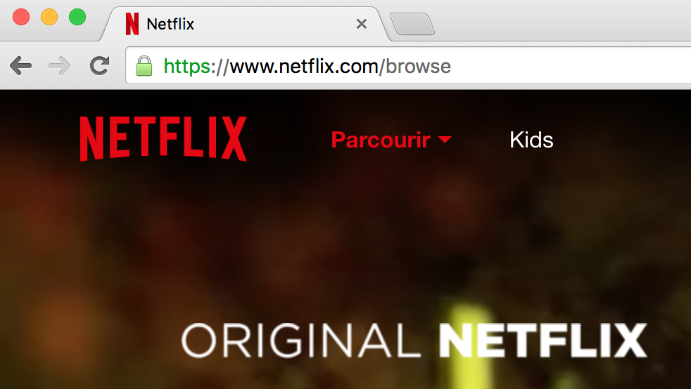
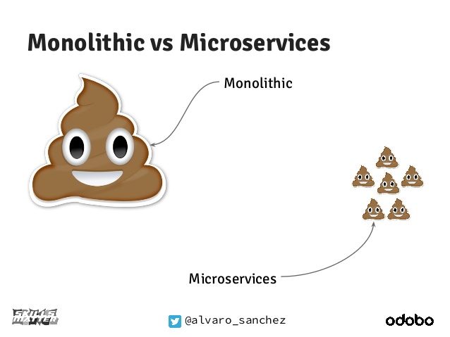
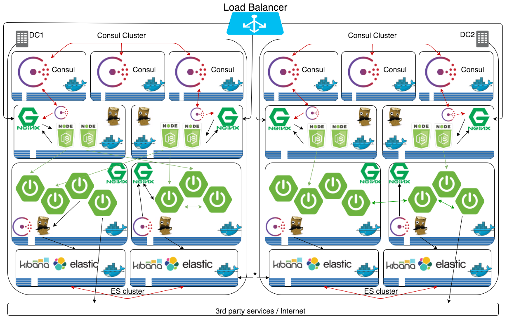

Formation Spring Cloud
======================
:author:    Daniel Lavoie
:copyright: Daniel Lavoie
:backend:   slidy
:max-width: 45em
:data-uri:
:icons: font

++++
<link rel="stylesheet"  href="http://cdnjs.cloudflare.com/ajax/libs/font-awesome/3.1.0/css/font-awesome.min.css">
++++

Les applications distribuées modernes ?
---------------------------------------

Aujourd'hui, le mot d'ordre est haute disponibilité et scalabilité.
Comment garantir que notre système respectera cette contrainte ?

Quelques pistes pour la haute disponibilité
-------------------------------------------

* Déploiement multi instance
* Services RESTfull
* Load balancing
* Routage dynamique

Bref...
-------

[.text-center]
[big]*Des microservices !* +

Pourquoi un déploiement multi instance ?
----------------------------------------

Du failover !!!

La vie est imprévisible ! Alors autant faire un backup ! Un backup c'est bien,
mais un système actif / actif, c'est mieux ! Le premier reflexe est donc d'avoir
un minimum de deux instances pour offrir un service.

Le secret résidera donc dans la capacité à ces services à répondre aux requêtes
qui leur sont addressé de manière transparente pour les clients.

La réponse dans un service RESTfull !
-------------------------------------

Un service sans état constitue la solution la plus adapté pour répartir une
charge sur plusieurs instance. Si la requête addressé  à un service est sans
état, nous avons la garantie que n'importe qui peut prétendre y répondre.

La voie ouverte pour du Load Balancing
--------------------------------------

Une fois que nous avons la certitude que les services de notre architectures
sont stateless, rien ne nous empêche de nous lancer avec des solutions de
`Load Balacing`. Un répartiteur de charge assura que notre plateforme pourra
scaler à volonté sans contrainte. Attention, ceci se limite à la couche
applicative. Les systèmes de persistences utilisé par la plateforme doivent
eux aussi être pensé pour scaler à leur manière.

Système distribué = système compliqué = Routage !
-------------------------------------------------

Inévitablement, une plateforme orienté micro service finit par englober une
myriade de service éparpillé partout. Ultimement, certains de ces services
ont pour but d'être exposé à des tiers. Par conséquent, il faut offrir un
mécanisme d'abstraction de l'architecture à ces tiers. Un client ne doit pas et
ne peut pas connaître la topologie physique des services déployés.

Et la haute disponibilité c'est gratuit ?
----------------------------------------

Et bien non ! Eclater un service à travers le réseau n'a pas que des avantages.
Une architecture orienté micro service est certe plus  élastique et maléable,
cependant elle introduit des contraintres pour lesquels des solutions sont
nécessaire.

* Service Discovery
* Configuration Management
* Load Balancing
* Reverse Proxy
* Circuit Breaking
* Messaging

Un petit rappel
---------------

Les dangers des microservices
-----------------------------

[.text-right]
Source : http://trustmeiamadeveloper.com/

Sans Service Discovery
----------------------

Imaginons une platforme de vente avec deux modules nécessitant de communiquer
entre eux.

image::images/problems/service-discovery-1.png[]

Avec cette configuration, chaque instance de service doit connaitre les adresses
permettant de rejoindre ses dépendences. Très rapidement, ce modèle ne tient pas
la route. Spécialement dans un context où des instances sont déployées à la
demande.

Avec Service Discovery
----------------------

La solution pour ce type de problème consiste à mettre à disposition un registre
de service hautement disponible. Chaque instance de la plateform peut donc
contacter le composant Service Discovery pour s'enregistrer et récupérer les
adresses de tous les services composant la plateforme. Les applications clientes
d'un registre de services doivent donc être penser pour s'adapter dynamiquement
aux adresses de leur dépendences.

image::images/problems/service-discovery-2.png[]

1 - Enregistrement au registre de service.

2 - Communications avec les services reçus du registre.

Configuration Management
------------------------

Derrière le problème solutionné par le Service Discovery se cache un problème
fondamentalement plus large. Il s'agit de la gestion de configuration.

Sur des applications legacy, les configurations sont généralement gérées dans
des fichiers. Encore une fois, une gestion manuelle ne permet pas de de scaler
l'application. Des outils de provisionning tel que Puppet ou Chef peuvent
se présenter comme une solution mais ne présentent pas la plus élégante.

Sans gestion de configuration centralisé
----------------------------------------

Sur ce type de système, chaque service porte lui même sa configuration. Chaque
évolution de configuration nécessite donc de mettre à jour tous ses fichiers
ou encore de redéployer les fichiers à travers les outils de provisionning.

Pas très pratique lorsqu'on parle d'application cloud.

image::images/problems/configuration-management-1.png[]

Avec gestion de configuration centralisé
----------------------------------------

La meilleur pratique qui soit dans ce domaine se traduit par l'utilisation d'un
service de configuration. Ce service est responsable d'héberger les
configurations et de les rendre accessible aux différents services de la
plateforme.

Ainsi, la seule configuration nécessaire à déployer en dur pour chaque service
concerne les instructions pour communiquer avec le service de configuration.

image::images/problems/configuration-management-2.png[]

Load Balancing
--------------

Dans un système distribué, on retrouve systématiquement plusieurs instances
pour un unique service. Avant même de parler de scalabilité, l'argument premier
restera la redondance des services. Deux approches sont possibles pour gérer un
Load Balancing.

* Load Balacing Serveur
* Load Balancer Client

Reverse Proxy
-------------

Le service discovery et la gestion centralisée de configuration permettent à
nos composant de communiqué entre eux de manière efficace. Cependant, ces
solutions impliquent une complexité et des contraintent qui ne peut être
imposée aux clients externes de notre application.

Reverse Proxy
-------------

La solution réside donc dans un Reverse Proxy frontal responsable d'abstraire
la complexité interne du système aux clients externes.

image::images/solutions/reverse-proxy.png[]

Circuit breaking
----------------

Do not beat a dead horse !

Circuit breaking
----------------

Rien se sert de s'engouffrer dans une queue qui s'empille et ne répond pas.

== De bonnes pratiques

* Fail Fast
* Mise en quarantaines des dépendences indisponibles

Messaging
---------

Les requêtes REST fonctionnent très bien pour des demandes de Request / Reply.

Parfois, certaines fonctionnalités s'implémente naturellement mieux avec un
système de notification par messagerie.

Distributed Tracing
-------------------

Il faut tenir compte que les traces qui étaient historiquement centralisés dans
les logs d'un unique service monolitique seront maintenant éclaté à travers
tous le parc de serveurs. Il est aussi à prendre en compte que certains logs
seront généré de manière aléatoire sur les différentes instances d'un même
service.

Il faut donc prévoir une solution pour tracer le parcours d'une requête à
travers tout le système.

ADN d'un micro service Spring Cloud
-----------------------------------

* Spring Boot
* Netflix OSS

Définition d'un microservice
----------------------------

[quote, James Lewis & Martin Fowler]
Microservice architectural style is an approach to develop a single
application as a suite of small services, each running in its own process
and communicating with lightweight mechanisms. These services are built
around business capabilities and independently deployable by fully automated
deployment machinery.

Pourquoi Spring Boot ?
----------------------

* Fourni des beans pré configuré pour chacun des modules Spring nécessaire à
  votre application.
* Approche de configuration opiniâtre pour les composants mais facile à
  surcharger pour un comportement personnalisé.
* Aucune génération de code ou de configuration XML.
* Package facilement votre application sous un jar exécutable depuis la
  commande `java -jar` ou sous un war conventionnel.

Les avantages de Spring Boot ?
------------------------------

* Evite la déclaration à répétition de beans incontournable de projets en
  projets.
* Permet de démarrer un projet très rapidement et de se concentrer sur les
  besoins métiers.
* Le packaging de Spring Boot uniformise le déploiement de l’application pour
  tous les environments (pas de conteneur JEE obligatoire).
* Tous les tutoriaux officiels de Spring sont maintenant basé sur Spring Boot
  (vous n’y échapperez pas !).
* Mécanisme d’AutoConfiguration qui permet de partager sur plusieurs projet
  l’instanciation de beans réutilisable.

Quelques modules exemples Spring Boot
-------------------------------------

[frame="topbot",options="header"]
|======================
|Nom      |Description
|spring-boot-starter-web          | Support for développement de la pile web
                                    complête en incluant Tomcat et spring-webmvc.
|spring-boot-starter-data-jpa     | Support pour “Java Persistence API” en
                                    incluant spring-data-jpa, spring-orm et
                                    Hibernate.
|spring-boot-starter-security     | Support pour spring-security.
|spring-boot-starter-data-mongodb | Support pour la base de données NoSQL
                                    MongoDB en incluant spring-data-mongodb.
|======================

.Liste complête de tous les starters
[NOTE]
http://docs.spring.io/spring-boot/docs/current/reference/htmlsingle/#using-boot-starter

Concepts Clés de Spring Boot
----------------------------

.Préparation d'un pom.xml
[source,xml]
----
  <parent>
    <artifactId>spring-boot-starter-parent</artifactId>
    <groupId>org.springframework.boot</groupId>
    <version>1.4.0.RELEASE</version>
  </parent>
----

.Dépendences minimales
[source,xml]
----
  <dependencies>
    <dependency>
      <groupId>org.springframework.boot</groupId>
      <artifactId>spring-boot-starter</artifactId>
    </dependency>
  </dependencies>
----

Concepts Clés de Spring Boot
----------------------------

++++

Exemple complet

++++

Concepts Clés de Spring Boot
----------------------------

==== Bootstrap de l'application

[source,java]
----
package com.invivoo.springboot.plain;

import org.springframework.boot.SpringApplication;
import org.springframework.boot.autoconfigure.SpringBootApplication;
import org.springframework.stereotype.Service;

@SpringBootApplication
public class PlanApplication {
  public static void main(String[] args) {
    System.out.println(
      SpringApplication.run(PlanApplication.class, args)
        .getBean(SuperService.class)
        .ping()
    );
  }

  @Service
  public class SuperService {
    public String ping() {
      return "pong";
    }
  }
}
----

Packaging de l'application
--------------------------

==== Ajout du plugin maven Spring Boot

[source,xml]
----
  <build>
    <plugins>
      <plugin>
        <groupId>org.springframework.boot</groupId>
        <artifactId>spring-boot-maven-plugin</artifactId>
      </plugin>
    </plugins>
  </build>
----

==== Build

----
$ mvn package
----

==== Exécution du microservice

----
$ java -jar target/my-app.jar
----

Atelier 1 - Injection de dépendences
------------------------------------

* Démarrage d'un conteneur Spring
* Injection de dépendencence.
* Injection de configuration.
* Test unitaire et test d'intégration.

.A mettre en favoris
[NOTE]
http://docs.spring.io/spring-boot/docs/current/reference/html/boot-features-external-config.html[Gestion de configuration avec Spring Boot]

Atelier 2 - Web Service JSON
----------------------------

* Exposition de web service
* Couche de persistence le JDBC Template.
* Sécurisation des web services.
* Tests des web services

.Pour aider à l'atelier
[NOTE]
https://raw.githubusercontent.com/daniellavoie/formation-spring-cloud/master/docker/atelier-2-mysql/docker-compose.yml[MySQL avec Docker] +
https://raw.githubusercontent.com/daniellavoie/formation-spring-cloud/master/sql/atelier-2-mysql.sql[Scripts SQL]

Atelier 3 - Persistence avec Spring Data
----------------------------------------

* Mise en place de Spring Data JPA
* Intégration base de données h2

.A mettre en favoris
[NOTE]
http://docs.spring.io/spring-boot/docs/current/reference/html/boot-features-sql.html[Reference SQL avec Spring Boot] +
http://docs.spring.io/spring-data/jpa/docs/current/reference/html[Reference Spring Data JPA]

Atelier 4 - Client Rest
-----------------------

* Utilisation du RestTemplate

.A lire tous les soirs
[NOTE]
http://docs.spring.io/spring-boot/docs/current/reference/html/common-application-properties.html[Configurations par défaut de Spring Boot]

Petite synthèse sur Spring Boot
-------------------------------

* Accélère le développement de Web Services
* Proposes des modules spring pré configurés.
* Permet de packager une application standalone.
* Service léger et interopérable

Spring Boot ne suffit-il pas ?
-------------------------------

Spring Boot est un outil formidable permettant d'obtenir une productivité
difficile à retrouver ailleurs. Naturellement, beaucoup de système basé
sur les microservices ont émergés sur une base de Spring Boot.

Ces systèmes ont tous été confrontés aux problématiques des architectures
distribués.
Pivotal et Netflix ont donc travaillé en compération pour offrir des solutions
à ces problèmes basé sur leur expérience en production.

Spring Cloud !
--------------

Spring Cloud est extension de Spring Boot offrant des solutions aux
différentes problématiques que représentent les systèmes distribués
(par exemple :  gestion de configuration, annuaire de service, load balancing,
routage, coupe circuits, etc).
Le framework facilite la communication inter process tout en assurant que les
différents services ne soit pas couplés autre que par le model de données.

Pour résumer, Spring Cloud facilite la communication entre applications
développé avec  Spring Boot.

Utiliser Spring Cloud dans une application Spring Boot
------------------------------------------------------

Rien de plus simple ! Il suffit de créer une application Spring Boot qui
importe des dépendences Spring Cloud.

[source,xml]
.pom.xml
----
  ...
  <dependencyManagement>
    <dependencies>
      <dependency>
        <groupId>org.springframework.cloud</groupId>
        <artifactId>spring-cloud-dependencies</artifactId>
        <version>Camden.RELEASE</version>
        <type>pom</type>
        <scope>import</scope>
      </dependency>
    </dependencies>
  </dependencyManagement>
  ...
----

Modules Spring Cloud
--------------------

* Spring Cloud Config
* Spring Cloud Netflix
** Eureka
** Spring Cloud Dashboard
** Ribbon
** Feign
** Hystrix
** Zuul
* Spring Cloud Stream
* Spring Cloud Bus
* Spring Cloud Sleuth
* Spring Cloud Consul
* Spring Cloud Zookeeper
* Spring Cloud Security

Spring Cloud Config
-------------------

Une gestion de configuration centralisé se présente comme un des première
problématique à laquelle nous devons répondre sur une architecture microservice.

Le projet Spring Cloud mêt donc à disposition des modules Spring Boot qui
permettent construire un serveur de configuration ainsi que des clients pouvant
être utilisé par des applications Spring Boot.

Spring Cloud Config Server
--------------------------

Le module Spring Cloud Config Server va servir d'interface HTTP à un backend de
configuration. Par défaut, le Config Server utilise un backend `git`. Des
implémentations peuvent être fourni pour supporter n'importe quel autre type
de repository. Cependant, `git` offre des fonctionnalités naturel aux concepts
suivies par le Config Server.

L'avantage du `Spring Cloud Config Server` résident dans les configurations
chargé depuis le service sont disponible à l'injection pour l'application.
Ce mécanisme s'insère nativement dans la gestion de configuration de Spring
Boot. Les `ConfigurationProperties` et `@Value` peuvent donc être utilisés sans
égard sur la provenance des configurations.

Quelques concepts du Config Server
----------------------------------

Application::
Un client sur `Config Server` doit reseigner le nom de son application avec la
propriété `spring.application.name`. Ce nom sera utilisé dans la résolution de
configuration sur le serveur.

Profile::
Un profil est une information complémentaire qui se grèffe dans la demande de
configuration. En pratique, le profile peut être utilisé pour spécifier
l'environment de l'instance application (ex : dev, test, hom, prod).

.Priorité des configurations
Le chargement des configurations servit par le serveur se fera en chargant par
ordre de priorité les fichiers suivants :

. *nom-application*-*profile*.properties
. application-*profile*.properties
. *nom-application*.properties
. application.properties

Implémentation d'un Config Server
---------------------------------

Implémenter un config server est très simple. Il s'agit d'une simple application
Spring Boot avec des dépendences spécifique et sur laquelle l'annotation
`@EnableConfigServer` a été déclaré. C'est le minimum requis pour obtenir un
serveur de configuration.

* Importation de `org.springframework.cloud:spring-cloud-config-server`.
* Déclaration de `@EnableConfigServer`.
* Configuration du backend de configuration dans `application.properties`.

Implémentation d'un Config Server
---------------------------------

.Importation des dépendences
[source,xml]
.pom.xml
----
  ...
  <dependency>
	  <groupId>org.springframework.cloud</groupId>
	  <artifactId>spring-cloud-config-server</artifactId>
  </dependency>
  ...
----

Implémentation d'un Config Server
---------------------------------

.Déclaration du @EnableConfigServer
[source,xml]
.ConfigServer.java
----
package com.invivoo.springcloud.configserver;

import org.springframework.boot.SpringApplication;
import org.springframework.boot.autoconfigure.SpringBootApplication;
import org.springframework.cloud.config.server.EnableConfigServer;

@EnableConfigServer
@SpringBootApplication
public class ConfigServer {
  public static void main(String[] args) {
    SpringApplication.run(ConfigServer.class, args);
  }
}
----

Implémentation d'un Config Server
---------------------------------

.application.properties
----
server.port: 8888
spring.cloud.config.server.git.uri: file://${user.home}/config-repo
----

Atelier 5 - Config Server
-------------------------

.Repository de configuration
[NOTE]
https://github.com/daniellavoie/formation-spring-cloud.git

.Pour tester votre serveur :
[NOTE]
http://localhost:8888/atelier-5/prod/config

.Pour un affichage JSON formaté depuis votre navigateur :
[NOTE]
https://jsonview.com/

Spring Cloud Config Client
--------------------------

A son démarrage, le client tentera de localiser un fichier
`bootstrap.properties` dans la racine du classpath de l'application.
Dans ce fichier doit figurer toutes les configurations nécessaire pour que le
service puisse contacter le Config Server et récupérer ses configurations.

.bootstrap.properties
----
spring.cloud.config.uri=      # URL du Config Server
spring.cloud.config.label=    # Branche sur laquelle les configurations
                              # sont situées
spring.cloud.config.username= # Utilisateur Git
spring.cloud.config.password= # Mot de passe Git
spring.cloud.config.failFast= # Empêche le service de démarrer si à
                              # 'true'.
----

.Dépendences

[source,xml]
.pom.xml
----
  ...
  <dependencies>
    <dependency>
      <groupId>org.springframework.cloud</groupId>
      <artifactId>spring-cloud-starter-config</artifactId>
    </dependency>
  </dependencies>
  ...
----

Atelier 6 - Config Server
-------------------------

Spring Cloud Netflix - Eureka
-----------------------------

Quelques caractéristiques sur le serveur Eureka :

* Construit spécialement pour un être hautement disponible.
* API HTTP Rest.
* Ne fournit pas de notification sur la mise à jour du registre.
* Synchronise automatiquement son état avec les autres instances Eureka.
* Ne s'impose pas entre le client et le serveur.

Spring Cloud Netflix - Eureka Server
------------------------------------

[source,xml]
.Importation des dépendences
----
    ...
    <dependency>
      <groupId>org.springframework.cloud</groupId>
      <artifactId>spring-cloud-starter-eureka-server</artifactId>
    </dependency>
    ...
----

[source,java]
.EurekaServer.java
----
  @EnableEurekaServer
  @SpringBootApplication
  public class EurekaServer {
  	public static void main(String[] args) {
  		SpringApplication.run(EurekaServer.class, args);
  	}
  }
----

Spring Cloud Netflix - Eureka Client
------------------------------------

Le module client d'eureka permet requêter

.C'est possible sans Eureka ?
[NOTE]
Spring Cloud a construit une abstraction au dessus du client Eureka. Il s'agit
du `DiscoveryClient`. Toutes implémentations du DiscoveryClient assure une
compatibilité aux autres solution de Service Discovery avec la stack Spring
Cloud.

Configuration du client Eureka
------------------------------

[source,xml]
.Importation des dépendences
----
    ...
    <dependency>
      <groupId>org.springframework.cloud</groupId>
      <artifactId>spring-cloud-starter-eureka</artifactId>
    </dependency>
    ...
----

.application.properties
----
spring.application.name= # Le nom de l'application doit être renseigné.
eureka.client.serviceUrl.defaultZone=http://localhost:8761/eureka
----

Eureka Client avec Config Server
--------------------------------

TBD

Spring Cloud Netflix - Spring Cloud Dashboard
---------------------------------------------

TBD

Spring Cloud Netflix - Ribbon
-----------------------------

TBD

Spring Cloud Netflix - Feign
----------------------------

TBD

Spring Cloud Netflix - Hystrix
------------------------------

TBD

Spring Cloud Netflix - Zuul
----------------------------

TBD

Spring Cloud Stream
-------------------

TBD

Spring Cloud Bus
----------------

TBD

Spring Cloud Sleuth
-------------------

TBD

Spring Cloud Zookeeper
----------------------

TBD

Spring Cloud Security
---------------------

TBD

Prêt pour la production ?
-------------------------

- Instance HA
